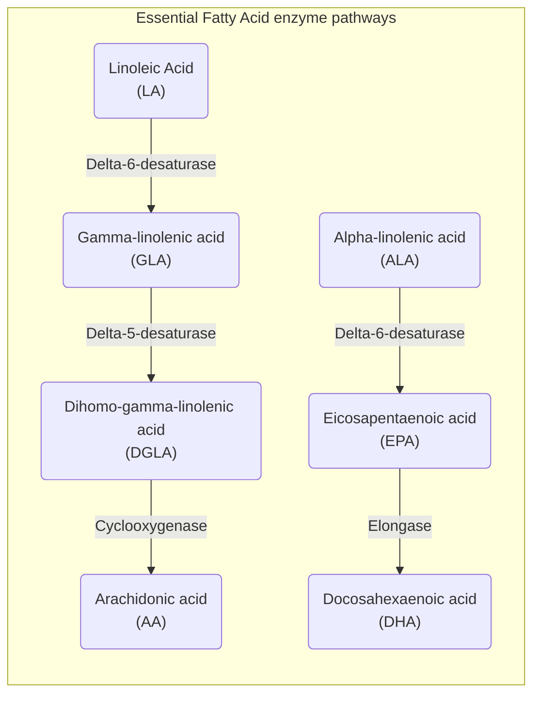

<pre class='mermaid'>
flowchart TB
subgraph main["Factors influencing Essential Fatty acid pathways"]
    Diet["Diet and Essential Fatty acids intake"]
    Nutrients["Nutrient status"]
    Hormones["Hormonal status"]
    Toxins["Environmental toxins"]
    Inflammations["Inflammation"]
    Genetics["Genetics"]
    Medications["Medications"]
end

subgraph DietSubgraph["Diet and Essential Fatty acids intake"]
    Ratio["Ratio of EFAs in the diet"]
    Deficiencies["Deficiencies & Lack of conversion"]
end

subgraph GeneticsSubgraph["Genetics and enzyme variations"]
    Delta-6-desaturase["Variations in delta-6-desaturase"]
    GLA["Impact on GLA conversion"]
end

subgraph NutrientsSubgraph["Nutrient status"]
    VitaminB6["Vitamin B6"]
    Zinc["Zinc"]
    Magnesium["Magnesium"]
    VitaminC["Vitamin C"]
end

subgraph HormonesSubgraph["Hormonal status"]
    Insulin["Insulin"]
    Thyroid["Thyroid hormones"]
end

subgraph ToxinsSubgraph["Environmental toxins"]
    Pesticides["Pesticides"]
    HeavyMetals["Heavy metals"]
end

subgraph InflammationsSubgraph["Inflammation"]
    ChronicInflammation["Chronic inflammation"]
end

subgraph MedicationsSubgraph["Medications"]
    OralContraceptives["Oral contraceptives"]
    AntiInflammatory["Anti-inflammatory drugs"]
    CholesterolLowering["Drugs used to lower cholesterol level"]
end

Medications --> MedicationsSubgraph
Toxins --> ToxinsSubgraph
Inflammations --> InflammationsSubgraph
Diet --> DietSubgraph
Genetics --> GeneticsSubgraph
Nutrients--> NutrientsSubgraph
Hormones --> HormonesSubgraph
</pre>
